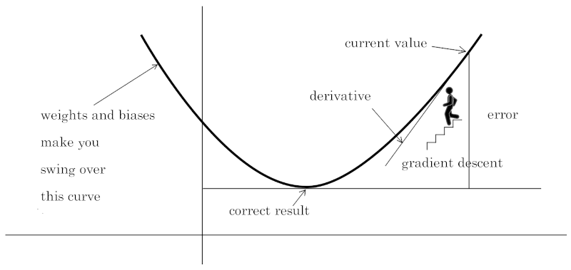

# XOR meets CNN weekend project

Educational/learning C/C++ code convolutional neural network

# CI/CD

# Credits

This code is based on the following tutorial:

  https://www.youtube.com/watch?v=LA4I3cWkp1E&list=PL2HXfWoj29oa9ZqBLH6OdXe9vpJcVfuOf&index=5&ab_channel=NicolaiNielsen

Compared to it I've added few additional features:

1. generalized network (with a configurable number of layers)
2. training with minibatches (for better statistical convergence)
3. usage of leaky relu (for negative values, to avoid dead neurons)
4. Quantization!!!!

# Building intuition

# Lessons learned

1. The "error" is the difference between the expected and the actual output. If you get a positive error, it means that the actual output is too small: as a consequence, the weights should be increased. If you get a negative error, it means that the actual output is too big: as a consequence, the weights should be decreased. In either cases the error is summed to the weights.
2. When using a Leaky ReLu Proportional error clipping is a must for training with minibatches otherwise your gradients not be able to approach the minimum: if you don't clip the error small enough, you don't coverge, for a definition of "enough" that I don't know yet (trial and error).
3. To verify convergence, you can reduce the training samples to one (e.g. `{0, 64} -> {64}`) and see if the output gets to be the expected one.
4. The slope of the Leaky ReLU is a parameter that you can tweak to get better results. I used 10% for negative values and 100% (1) for positive values.
5. The learning rate is a parameter that you can tweak to get better results. I used 0.001.
6. Keep a fixed random seed randomness to have control over the training with reproducible weights adjustments progression.
7. It's useless to do the back propagation for ever forward step and error calc done within the minibbatch. Instead, sum the activations and errors in the forward pass step and than do the back propagation step only once.
8. Normalization must be done on the activations before the pass through the activation function.
9. Normalization / clipping is applied to the gradient error and not directly the weights and biases after the gradient is applied (added), otherwise you deviate the gradient descent.
10. Normalization / clipping must be done per layer, not on the overall network.
11. My minimal setup is to learn the XOR function. The minimal network for this is 2 inputs, 1layer with 2 nodes and 1 output. The structural "rigidity" of this configuration, coupled with the used of quantized values (not using floats) makes convergence occur ~50% of the times. Otherwise we reach a symmetrical non convergence point from which we cannot escape. Adding nodes to the hidden layer allows for >> 50% convergence.
11. Still learning and MAYBE some of the above quotes might prove wrong!
